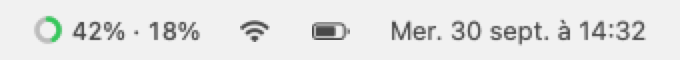
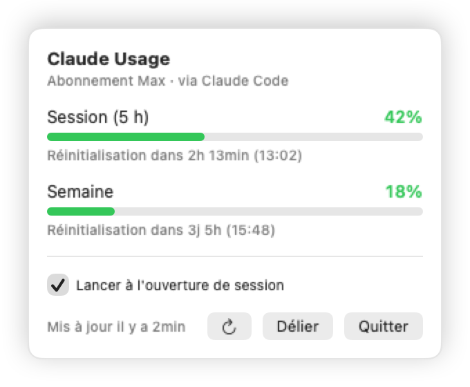

# Claude Usage

Petite app macOS native qui affiche ta consommation Claude en direct dans la barre de menus.

<p align="center"><a href="README.md">English</a> · <b>Français</b></p>

<p align="center">
  <picture>
    <source media="(prefers-color-scheme: dark)" srcset="docs/fr/menubar-dark.png">
    
  </picture>
</p>
<p align="center">
  <picture>
    <source media="(prefers-color-scheme: dark)" srcset="docs/fr/popup-dark.png">
    
  </picture>
</p>

L'anneau et les deux nombres correspondent à ta **session 5 h** et à ta **limite hebdomadaire**, les mêmes
valeurs que la commande `/usage` de Claude Code. Un clic sur l'icône ouvre le détail : jauges, heures de
réinitialisation, abonnement et liaison du compte.

- **Natif et léger** : Swift + SwiftUI, un seul `MenuBarExtra`, pas d'Electron, pas d'icône Dock.
- **Liaison sans configuration** : réutilise la session que Claude Code stocke déjà dans le Trousseau.
- **Connexion autonome** : ou connecte-toi avec Claude depuis l'app (OAuth + PKCE, le même flux que Claude Code).
- **Respect de la vie privée** : les jetons restent dans le Trousseau macOS et ne sont envoyés qu'à l'API d'Anthropic.
- **Toujours là** : se lance à l'ouverture de session par défaut (élément d'ouverture macOS standard, sans helper) ; décoche la case dans le popup pour désactiver.
- **Interface localisée** : anglais par défaut, français inclus (suit la langue du système). Pour ajouter une langue, déposer un `<lang>.lproj/Localizable.strings` dans `Sources/ClaudeUsage/Localization/`.

## Installation

Nécessite macOS 14 (Sonoma) ou plus récent. Compiler depuis les sources demande Xcode 15+ (ou les Command Line Tools).

**Homebrew** (recommandé) :

```bash
brew install --no-quarantine spritrl/tap/claude-usage
```

`--no-quarantine` évite l'avertissement Gatekeeper pour cette app signée ad hoc. Mises à jour : `brew upgrade --cask claude-usage`.

**Téléchargement** : récupère `ClaudeUsage.app.zip` dans la [dernière release](https://github.com/spritrl/claude-usage/releases/latest),
dézippe, déplace l'app dans `/Applications`. Au premier lancement, clic droit → **Ouvrir** si Gatekeeper proteste.

**Depuis les sources** :

```bash
git clone https://github.com/spritrl/claude-usage.git
cd claude-usage
make install     # compile en release, copie l'app dans /Applications et la lance
```

Autres cibles : `make run` (compile et lance depuis `build/`), `make bundle`, `make clean`.

## Lier ton compte

Au premier lancement, l'app cherche le jeton OAuth que Claude Code conserve dans le Trousseau
(`Claude Code-credentials`). macOS peut demander une autorisation : choisis **Toujours autoriser**.

Si Claude Code n'est pas installé ou pas connecté, le popup propose deux options :

| Option | Ce qui se passe |
| --- | --- |
| **Lier via Claude Code** | Relit l'entrée du Trousseau. |
| **Se connecter avec Claude** | Ouvre claude.ai dans le navigateur et revient automatiquement via un callback `localhost`. Si le navigateur ne redirige pas, **Connexion manuelle** affiche un champ où coller le code `code#state` donné par claude.ai. |

Les jetons obtenus par l'app sont stockés dans le Trousseau sous `com.chris.claude-usage` et rafraîchis
automatiquement. **Délier** les supprime. L'entrée Trousseau de Claude Code n'est jamais modifiée.

## Fonctionnement

- Interroge `GET https://api.anthropic.com/api/oauth/usage` toutes les 3 minutes, et à l'ouverture du popup
  si les données datent de plus de 15 secondes. Back-off automatique en cas de `429`.
- Couleurs : vert sous 50 %, orange sous 80 %, rouge à partir de 80 % (sur la plus élevée des deux fenêtres).
- Si la session Claude Code expire alors que le terminal est fermé, l'app te demande de relancer `claude`.
  Elle n'utilise jamais le refresh token de Claude Code.

## Structure

```
Sources/ClaudeUsage/
├── ClaudeUsageApp.swift        MenuBarExtra (style fenêtre)
├── Models/                     UsageSnapshot, OAuthCredentials
├── Services/                   ClaudeCodeKeychainReader, AppKeychainStore, OAuthService,
│                               LocalCallbackServer, UsageAPIClient
├── Store/UsageStore.swift      État observable, liaison, polling
├── Views/                      MenuBarLabel + icône, PopoverView, LinkAccountView, UsageView
├── Localization/               en.lproj + fr.lproj (les clés sont les textes anglais)
└── Localization.swift          tr() : String(localized:bundle: .module)
```

Compilation avec `swift build`, sans projet Xcode. `scripts/bundle.sh` emballe le binaire dans
`build/ClaudeUsage.app` et le signe (`CODESIGN_IDENTITY="Apple Development: …"` pour ta propre identité).

## Limites

- L'endpoint d'usage n'est pas documenté officiellement. C'est celui que Claude Code appelle lui-même,
  mais il peut changer sans préavis.
- Avec la signature ad hoc, macOS peut redemander l'accès au Trousseau après une recompilation.
- Projet indépendant, sans lien avec Anthropic.

## Contribuer

Issues et pull requests bienvenues. Garde les changements petits et ciblés, et vérifie que `swift build`
passe sans warning.

## Licence

[MIT](LICENSE)
