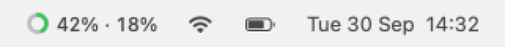
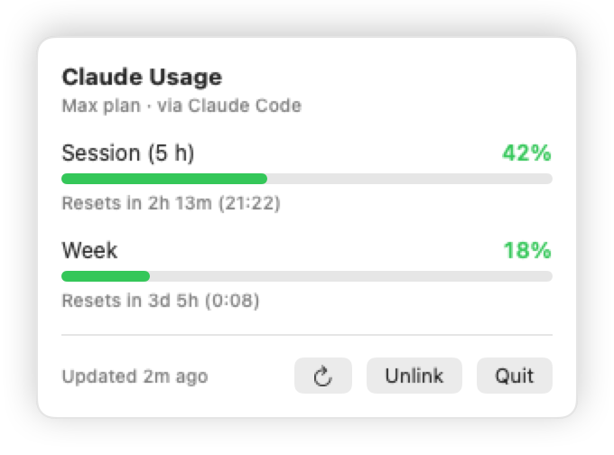

# Claude Usage

A tiny native macOS menu bar app that shows your Claude subscription usage in real time.

> 🇫🇷 [Version française](README.fr.md)

<p align="center">
  <picture>
    <source media="(prefers-color-scheme: dark)" srcset="docs/menubar-dark.png">
    
  </picture>
</p>
<p align="center">
  <picture>
    <source media="(prefers-color-scheme: dark)" srcset="docs/popup-dark.png">
    
  </picture>
</p>

The ring and the two numbers are your **current 5-hour session** and your **weekly** limit, the same
values Claude Code prints with `/usage`. Click the icon for the details: progress bars, reset times,
your plan, and account linking.

- **Native and lightweight**: Swift + SwiftUI, one `MenuBarExtra`, no Electron, no Dock icon.
- **Zero-config linking**: reuses the session Claude Code already stores in your Keychain.
- **Standalone login**: or sign in with Claude directly from the app (OAuth + PKCE, same flow as Claude Code).
- **Private by design**: tokens live only in the macOS Keychain and are sent only to Anthropic's API.
- **Localized**: English by default, French included. Add a language by dropping a `<lang>.lproj/Localizable.strings` in `Sources/ClaudeUsage/Localization/`.

## Install

Requires macOS 14 (Sonoma) or later. Building from source needs Xcode 15+ (or the Command Line Tools).

**Homebrew** (recommended):

```bash
brew install --no-quarantine spritrl/tap/claude-usage
```

`--no-quarantine` skips the Gatekeeper warning for this ad-hoc signed app. Later updates: `brew upgrade --cask claude-usage`.

**Download**: grab `ClaudeUsage.app.zip` from the [latest release](https://github.com/spritrl/claude-usage/releases/latest),
unzip, move the app to `/Applications`. On first launch right-click → **Open** if Gatekeeper complains.

**From source**:

```bash
git clone https://github.com/spritrl/claude-usage.git
cd claude-usage
make install     # builds a release .app, copies it to /Applications and launches it
```

Other targets: `make run` (build and launch from `build/`), `make bundle`, `make clean`.

## Link your account

On first launch the app looks for the OAuth token Claude Code keeps in the Keychain
(`Claude Code-credentials`). macOS may ask for permission: choose **Always Allow**.

If Claude Code is not installed or not logged in, the popup offers two options:

| Option | What happens |
| --- | --- |
| **Link via Claude Code** | Reads the Keychain entry again. |
| **Sign in with Claude** | Opens claude.ai in your browser and comes back automatically through a `localhost` callback. If the browser never redirects, **Manual sign-in** shows a field where you paste the `code#state` value claude.ai displays. |

Tokens obtained by the app are stored in the Keychain under `com.chris.claude-usage` and refreshed
automatically. **Unlink** removes them. The app never modifies Claude Code's own Keychain entry.

## How it works

- Polls `GET https://api.anthropic.com/api/oauth/usage` every 3 minutes, and when you open the popup
  if the data is older than 15 seconds. Backs off automatically on `429`.
- Colors: green below 50 %, orange below 80 %, red from 80 % (based on the higher of the two windows).
- If the Claude Code session expires while your terminal is closed, the app tells you to run `claude`
  again to renew it. It never uses Claude Code's refresh token.

## Project layout

```
Sources/ClaudeUsage/
├── ClaudeUsageApp.swift        MenuBarExtra (window style)
├── Models/                     UsageSnapshot, OAuthCredentials
├── Services/                   ClaudeCodeKeychainReader, AppKeychainStore, OAuthService,
│                               LocalCallbackServer, UsageAPIClient
├── Store/UsageStore.swift      Observable state, linking, polling
├── Views/                      MenuBarLabel + icon, PopoverView, LinkAccountView, UsageView
├── Localization/               en.lproj + fr.lproj (keys are the English strings)
└── Localization.swift          tr(): String(localized:bundle: .module)
```

Build with `swift build`; there is no Xcode project. `scripts/bundle.sh` wraps the binary into
`build/ClaudeUsage.app` and signs it (`CODESIGN_IDENTITY="Apple Development: …"` to use your own identity).

## Caveats

- The usage endpoint is not officially documented. It is the one Claude Code itself calls, but it may
  change without notice.
- With ad-hoc signing, macOS may ask for Keychain access again after you rebuild the app.
- This is an independent project, not affiliated with Anthropic.

## Contributing

Issues and pull requests are welcome. Keep changes small and focused, and make sure `swift build`
passes without warnings.

## License

[MIT](LICENSE)
